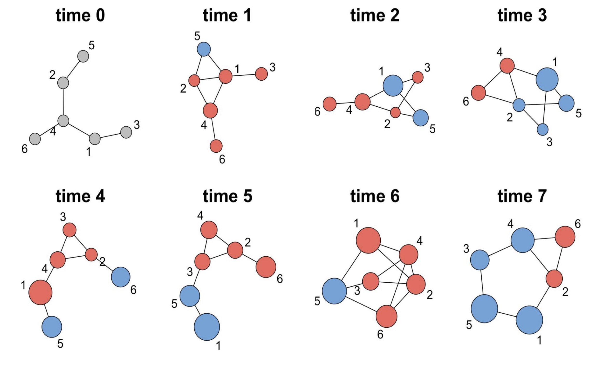

# 📊 Ando, H., Nishi, A., & Handcock, M. S. (2025). Statistical Modeling of Networked Evolutionary Public Goods Games.

------------------------------------------------------------------------

This repository, developed by **Hiroyasu Ando** and **Mark S. Handcock**, provides all data and scripts used in the statistical analysis of dynamic network structures arising from repeated networked public goods games. It contains 20 independent longitudinal networks across eight time points, along with complete tools for conducting maximum likelihood estimation (MLE), robustness and sensitivity analyses, and goodness-of-fit evaluations. The repository enables full replication of the modeling framework and empirical results presented in the study. 

------------------------------------------------------------------------

## 📁 Data

### `pgg_data.RData`

-   A collection of 20 independent dynamic networks from the networked
    public goods game.
-   Each network spans 8 time points (0 to 7).
-   Stored as `igraph` objects.

### `pgg_adj.RData`

-   The same networks as above, represented as adjacency matrices.

### `pgg_plus_data.RData` / `pgg_plus_adj.RData`

-   All possible `Y⁺` (formation) network data for each
    network from time 1 to 7.
-   `igraph` objects (`pgg_plus_data.RData`) and adjacency matrices
    (`pgg_plus_adj.RData`).
-   Can be regenerated using the [`plus_network.R`](#scripts) script.

### `pgg_minus_data.RData` / `pgg_minus_adj.RData`

-   All possible `Y⁻` (persistence) network data for
    each network from time 1 to 7.
-   `igraph` objects (`pgg_minus_data.RData`) and adjacency matrices
    (`pgg_minus_adj.RData`).
-   Can be regenerated using the [`minus_network.R`](#scripts) script.

------------------------------------------------------------------------

## 📜 R-Scripts

### `plus_network.R`

Generates all possible `Y⁺` (formation) networks.

**Outputs:**  

- `pgg_plus_data.RData` 
- `pgg_plus_adj.RData`

------------------------------------------------------------------------

### `minus_network.R`

Generates all possible `Y⁻` (persistence) networks.

**Outputs:**  

- `pgg_minus_data.RData` 
- `pgg_minus_adj.RData`

------------------------------------------------------------------------

### `plus_model.R` / `minus_model.R`  
Main model for **Table 1**. 

**Outputs:**  

- Maximum likelihood estimates (MLE)  
- Standard errors  
- Log-likelihood  

------------------------------------------------------------------------

### `plus_model_non_triangle.R` / `minus_model_non_triangle.R`  
Covariates-only model (without the triangle term) used for **Table 2** and **Figure 5**.  

**Outputs:**  

- Maximum likelihood estimates (MLE) 
- Standard errors  
- Log-likelihood  

------------------------------------------------------------------------

### `plus_model_gender.R` / `minus_model_gender.R`  
Main model with the gender covariates for the sensitivity analysis.  

**Outputs:**  

- Maximum likelihood estimates (MLE)  
- Standard errors  
- Log-likelihood  

------------------------------------------------------------------------

### `plus_model_2_star.R` / `minus_model_2_star.R`  
Main model with an added 2-star term for the sensitivity analysis.  

**Outputs:**  

- Maximum likelihood estimates (MLE)  
- Standard errors  
- Log-likelihood  

------------------------------------------------------------------------

### `model_each_time.R`  
Models at each time step, used for **Figures 7 & 8**.  

**Outputs:**  

- Maximum likelihood estimates (MLE)  
- Standard errors  
- Log-likelihood  

------------------------------------------------------------------------

### `graph_model_each_time.R`  
Generates visualizations of time-specific model results, used for **Figure 7** and **Figure 8**. 

------------------------------------------------------------------------

### `graph_dynamic_network.R`  
Visualizes the dynamic evolution of the network over time, used for **Figure 4**.  

------------------------------------------------------------------------

### `gof_triangle_formation.R`  
Generates triangle GoF plots for the formation networks, used for **Figure 5**.  

------------------------------------------------------------------------

### `gof_k_star.R`  
Generates k-stars GoF plots for the public goods game networks, used for **Figure 6**. 

------------------------------------------------------------------------

### `gof_degree.R`  
Produces k-degrees GoF plots for the public goods game networks.

------------------------------------------------------------------------

## 📦 Requirements

-   R (≥ 4.0.0)
-   `igraph`
-   `tidyverse`
-   `Matrix`
-   `parallel`
-   `latex2exp`

------------------------------------------------------------------------

## 📄 Citation

If you use this code or data, please cite the original paper: 

**Ando, H., Nishi, A., & Handcock, M. S. (2025). Statistical Modeling of Networked Evolutionary Public Goods Games.**

-----------------------------------------------------------------------

## 📬 Contact

For questions or collaborations, please reach out to:

**Hiroyasu Ando**  
📧 hiro1999@g.ucla.edu

-----------------------------------------------------------------------
